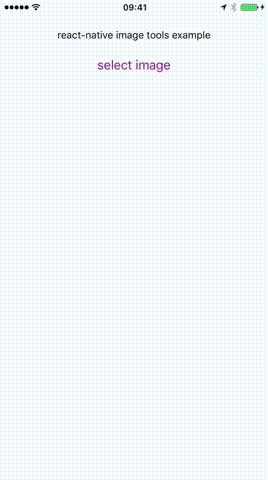

# react-native-image-tools

Image editing software powered by Abode Creative SDK for iOS and Android.  To use this you will need to create an adobe account.  And to run on iOS you will need to download the SDK binaries from Adobe.  Before releasing your app you will also need to get approval from Adobe.

Install instructions [here](./docs/install.md).
